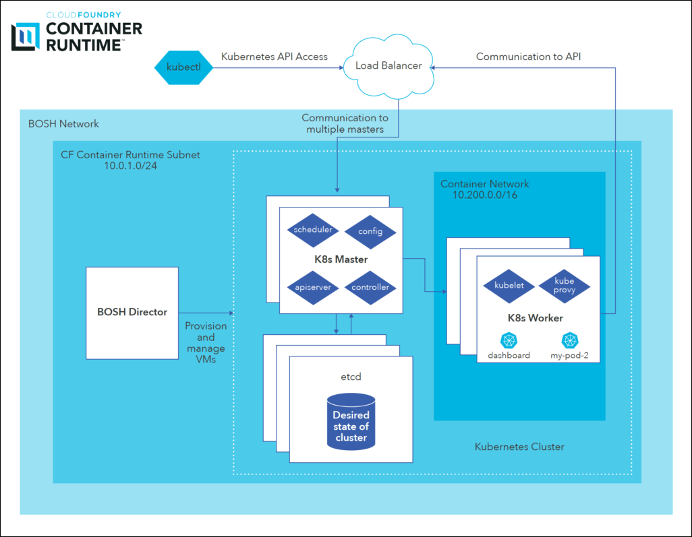
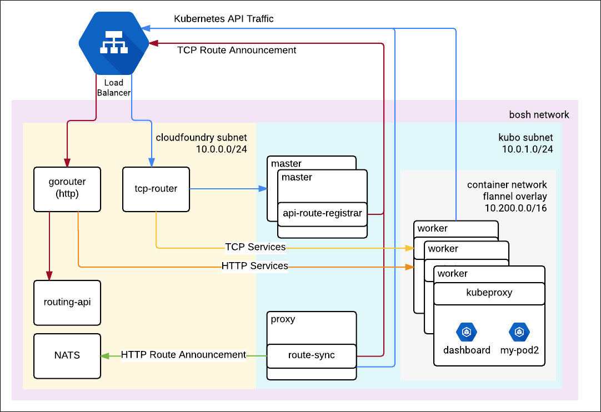

#Product Architecture

This topic describes the product architecture of Cloud Foundry Container Runtime (CFCR).

## Overview

CFCR runs in its own subnet, with a dedicated [BOSH Director](https://bosh.io/docs/bosh-components.html#director) that manages the CFCR component VMs. The Director handles VM creation, health checking, and resurrection of missing or unhealthy VMs. 

The Director uses [CredHub](https://github.com/cloudfoundry-incubator/credhub) and BOSH's [local DNS](https://bosh.io/docs/dns.html#enable) to handle certificate generation within the CFCR clusters. Credhub is also used to store the auto-generated passwords.

##CFCR Components

By default, CFCR provisions a Kubernetes cluster with the following components:

* 2 master nodes
* 3 worker nodes
* 3 etcd nodes
* 1 proxy node

	!!! note
		The single proxy node front-loads the [kube-proxy](#kubernetes-components), the Kubernetes network proxy that runs on each worker node. For IaaSes that support load balancers, the proxy node is not required.

See the [Kubernetes Components](#kubernetes-components) section for more information about how a Kubernetes cluster works.

### Internal Component Communication

CFCR uses [Flannel](https://github.com/coreos/flannel) to create an overlay network for the worker nodes, so that they can all share a virtual IP subnet, regardless of the IP addressing set by the underlying IaaS. Flannel is the recognized standard for Kubernetes clusters.

The [API server](#kubernetes-components) on the master nodes handles the communication between them and the worker nodes.

For master to worker communication, the worker node uses its hostname as its IP address.

##How a Kubernetes Cluster Works

Every Kubernetes cluster is made up of the following components:

* One or more [master nodes](#master-nodes)
* One or more [worker nodes](#worker-nodes), previously called “minions”
* A watchable, distributed [datastore](#datastore) that uses [etcd](https://github.com/coreos/etcd) to store cluster metadata

For more information about Kubernetes clusters, see the [Kubernetes documentation](https://kubernetes.io/docs/home/).

###Master Nodes

The master nodes schedule and control the workloads on the worker nodes. 

Each master node is made up of the following components:

* The **API server** provides a means of interacting with the master node for both internal components and end users. The API itself is stateless and all data is stored in the datastore nodes.
* The **scheduler** selects a worker node for a particular workload.
* The **controller manager** checks if a desired state is reached. If not, it submits commands to the master node to work towards it.

###Worker Nodes

Each worker node is made up of the following components:

* The **kubelet** controls the worker node and serves as the entrypoint for communication from the master node. It keeps track of available resources and running processes.
* The **kube-proxy** ensures the service CIDR is routable and that packets are forwarded correctly. 
* The **container runtime** runs the containers and [pods](https://kubernetes.io/docs/concepts/workloads/pods/pod-overview/), which are groups of one or more containers.

###Datastore Nodes

The etcd datastore nodes store the metadata used by the scheduler and the controller manager to operate the cluster. This metadata includes current state of each worker, the pods running in the cluster, as well as the desired state as defined by the users of the cluster.

##Network Topologies 

CFCR can use different routing options to expose the applications run by the Kubernetes cluster.

###IaaS Load Balancers

If your IaaS provides load balancers, you can use them to handle traffic for your CFCR instance.

Consult the following diagram for an example network topology.

The IaaS-specific load balancer exposes the master nodes that run the Kubernetes API. The load balancer has an external static IP address that acts as both the public and the internal endpoint for traffic to the Kubernetes API.

You can also configure a second IaaS-specific load balancer to forward traffic to the Kubernetes worker nodes.

###Cloud Foundry Routing

If you deploy CFCR alongside [Cloud Foundry](https://docs.cloudfoundry.org), the Cloud Foundry routers handle traffic for your CFCR deployment, and CFCR and Cloud Foundry each have their own BOSH Director.

Keep Cloud Foundry and CFCR in separate subnets to avoid the BOSH Directors from trying to provision the same addresses, but ensure that the Cloud Foundry subnet can route traffic to the CFCR subnet. See [Configuring Cloud Foundry Routing](/installing/cf-routing/index.html) for how to configure Cloud Foundry to handle routing for CFCR.

Consult the following diagram for an example network topology.

!!! note
	The diagram uses Kubo, the old name for CFCR.

The master nodes that run the Kubernetes API register themselves with the Cloud Foundry TCP router. The TCP router acts as both the public and internal endpoint for the Kubernetes API to route traffic to the master nodes of a CFCR instance. All traffic to the API goes through the Cloud Foundry TCP router and then to a healthy node.

The diagram above specifies CIDR ranges for demonstration purposes, as well as a public router in front of the Cloud Foundry `gorouter` and `tcp-router`, which is typical in Cloud Foundry deployments.

